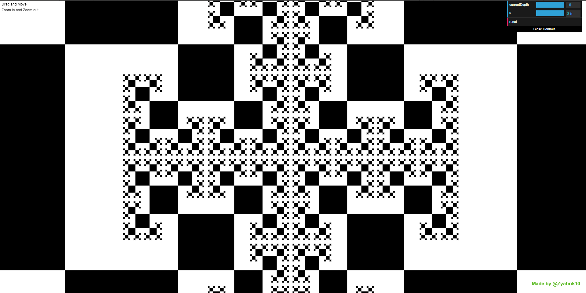

# Square Fractal

Good morning to you. Let me introduce my simple but marvelous project. It is a fractal, and as the project's name says, it is The Fractal that consists of squares. Pretty charming, I would say. You can observe the fractal just by dragging it around and zooming in or out. You are also able to increase or decrease the depth of the fractal from level 1 to level 10, where 1 and 10 are the minimum and maximum depth of the fractal. Why 1 and 10? Well, 0 depth level means you don't have any squares, and 10 is the maximum depth of squares which can quickly be redrawn by my algorithm.

## About my work

I want to share my projects with people and also explain how I developed them, detailing every aspect of my work so that everyone can understand how it works. This process will help improve my skills in creating documentation.

Here is an explanation of the code I wrote. Both the explanation and the code itself can be improved, so feel free to share your opinion and experience with me at [Zyabrik10@gmail.com](Zyabrik10@gmail.com).

## Demo




Have a fun. Hope you will enjoy it: [Demo link](https://zyabrik10.github.io/Square-Fractal/)

## How it works?

### Global variables

`canvas` variable is to store canvas `DOMElement`.

`ctx` variable is to store functions, which are provided by canvas api by `getContext("2d")` mehtod

```js
let canvas, ctx; // Will be initialized in window on load.
```

---

Calculated so: `canvas.width / 2`, `canvas.height / 2`.

```js
let halfCanvasWidth, halfCanvasHeight; // Will be initialized in window on load.
```

---

`settings` is an object which contains dependencies for all app and GUI.

`startPoint` is an object which contains coordinates of root square and is used in settings for `startPoint property` as default value.

```js
let startPoint, settings; // Will be initialized in window on load.
```

---

We need mouse object to store mouse state.

`downOffset` - is used in canvas mousedown

`isDown` - is used in canvas mousedown, mouseup, mousemove

```js
let mouse = {
  downOffset: { x: 0, y: 0 },
  isDown: false,
};
```

---

#### Default values for entire app

You can modify them all.

`currentDepth` - defines what default depth of fractal will be.

For example: 5 means it will 5 squares in a row in depth.

`size` - defines start size of root square, is used in settings and on wheel event for zoom in and out effect.

`zoom` - strength of zooming (+- 10px to the size of root square per wheel), also is used in on wheel event for zoom in and out effect.

```js
const currentDepth = 5;
const size = 200;
const zoom = 10;
```

#### Code preview

```js
let canvas, ctx;

let halfCanvasWidth, halfCanvasHeight;

let startPoint, settings;

let mouse = {
  downOffset: { x: 0, y: 0 },
  isDown: false,
};

const currentDepth = 5;
const size = 200;
const zoom = 10;
```

### Functions and what they do

#### drawOptimizedSquare(x, y, size)

`drawOptimizedSquare()` is called in `drawFractal()` function

To use the `ctx` function `fillRect`, we need to pass it four parameters: x, y, width, and height of the rectangle we want to draw.

```js
ctx.fillRect(x, y, width, height);
```

Since we want to draw a square, the width and height are equal and are represented by the parameter `size`.

When the square we want to draw is not in our sight (viewport), it won't be drawn and vice versa.

1. ```js
   x + size >= 0 && y + size >= 0;
   x + size; // -> right side of the square
   y + size; // -> bottom side of the square
   ```

   We make sure that right and bottom sides are present in the viewport
2. ```js
   x <= innerWidth && y <= innerHeight:
   x; // -> left side of the square
   y; // -> top side of the square
   ```

   We ensure that the left and top sides are present in the viewport.

##### Function preview

```js
function drawOptimizedSquare(x, y, size) {
  if (x + size >= 0 && y + size >= 0 && x <= innerWidth && y <= innerHeight) {
    ctx.beginPath();
    ctx.fillRect(x, y, size, size);
  }
}
```

#### drawFractal()

Main recursive function that makes calculations, where to allow drawing a square, before actually drawing.

Key thoughts:

- We don't need to draw an infinite number of squares, only as many as desired.
- `currentDepth` is a counter that represents the current depth in each square.
- A new square takes a new `currentDepth` decreased by one.

Parameters explanation:

- `x`and`y` are the coordinates representing the top-left corner of each parent square.
- `size` is the size of the current square, calculated based on the parent square's size.
- `Offset`is an object with two properties:`x`and`y`.

  - These properties can only be `0` or `1`.
  - They are coefficients used to position the child square correctly in the corners.

We perform simple calculations based on these offsets.

Corner square offsets are provided by hardcoding:

* `1 1` - top left corner
* `0 1` - top right corner
* `0 0` - bottom right corner
* `1 0` - bottom left corner

This offset is used in the main offset calculation `size * offset` to determine if we need to make a `left`, `right`, or `no offset` adjustment according to the parent square's coordinates.

For example, if the parent square has coordinates `x = 0`, `y = 0` and its `size` is `100px`, then:

- To draw a `top left` corner square, we calculate:

  ```txt
   __- top  square | child square
  |__|____
    |    |
    |____| - parent square
  ```

  ```js
  squareX = 0 - 100 * 1 = -100
  squareY = 0 - 100 * 1 = -100
  ```
- To draw a `top right` corner square, we calculate: -> `x = 0 + 100, y = 0 - 100` (so our calculation will be according to `top right` corner of the parent square):

  ```txt
        __
   ____|__| - top right square | child square
  |    |
  |____| - parent square
  ```

  ```js
  squareX = 100 - 100 * 0 = 100
  squareY = 0 - 100 * 1 = -100
  ```
- To draw a `bottom right` corner square, we calculate: -> `x = 0 + 100, y = 0 + 100` (so our calculation will be according to `bottom right` corner of the parent square):

  ```txt
   ____
  |    | - parent square
  |____|__
       |__| - bottom right square | child square
  ```

  ```js
  squareX = 100 - 100 * 0 = 100
  squareY = 100 - 100 * 0 = 100
  ```
- To draw a `bottom left` corner square, we calculate: -> `x = 0 - 100, y = 0 + 100` (so our calculation will be according to `bottom left` corner of the parent square):

  ```txt
      ____
     |    | - parent square 
   __|____|
  |__| - bottom left square | child square
  ```

  ```js
  squareX = 0 - 100 * 1 = -100
  squareY = 100 - 100 * 0 = 100
  ```

We avoid unnecessary calculations for squares that will not be visible. For instance:

For the `top left` square, we don't need to draw the `bottom right` square.

```txt
 __ - top left square
|__|____
   |__| | - this square inside, we don't need it
   |____|
```

For the `top right` square, we don't need to draw the `bottom left` square.

```txt
      __
 ____|__| - top right square
| |__| - this square inside, we don't need it
|____|
```

For the `bottom right` square, we don't need to draw the `top right` square.

```txt
    ____
   |__  |
 __|__|_| - this square inside, we don't need it
|__| - bottom left square
```

For the `bottom left` square, we don't need to draw the `top left` square.

```txt
 ____
|  __| - this square inside, we don't need it
|_|__|__
     |__| - bottom right square
```

We use a bitmask to determine which sides and corners need to be drawn:

* `1111` - All corners have squares
* `1110` - Without the `bottom left` square
* `1101` - Without the `bottom right` square
* `1011` - Without the `top right` square
* `0111` - Without the `top left` square

In this bitmask:

* `1` - indicates that we calculate and draw the child square.
* `0` - indicates that we do not calculate and draw the child square.

##### Function preview

```js
function drawFractal({
  x,
  y,
  size,
  currentDepth,
  k = 0.5,
  sides = "1111",
  offset = {
    x: 1,
    y: 1,
  },
}) {
  if (currentDepth <= 0) return;

  let squareX = x - size * offset.x;
  let squareY = y - size * offset.y;

  drawOptimizedSquare(squareX, squareY, size);

  if (sides.startsWith("1")) {
    drawFractal({
      x: squareX,
      y: squareY,
      size: size * k,
      currentDepth: currentDepth - 1,
      k,
      sides: "1101",
    });
  }

  if (sides[1] === "1") {
    drawFractal({
      x: squareX + size,
      y: squareY,
      size: size * k,
      currentDepth: currentDepth - 1,
      k,
      offset: {
        x: 0,
        y: 1,
      },
      sides: "1110",
    });
  }

  if (sides[2] === "1") {
    drawFractal({
      x: squareX + size,
      y: squareY + size,
      size: size * k,
      currentDepth: currentDepth - 1,
      k,
      offset: {
        x: 0,
        y: 0,
      },
      sides: "0111",
    });
  }

  if (sides.endsWith("1")) {
    drawFractal({
      x: squareX,
      y: squareY + size,
      size: size * k,
      currentDepth: currentDepth - 1,
      k,
      offset: {
        x: 1,
        y: 0,
      },
      sides: "1011",
    });
  }
}
```

#### draw()

`draw()` is supposed to redraw the fractal every time the user zooms in/out or moves the fractal by clearing the canvas with `ctx` and calling `drawFractal()`.

It is called for the first time when the window is loaded.

##### Function preview

```js
function draw() {
  ctx.clearRect(0, 0, canvas.width, canvas.height);
  drawFractal({
    x: settings.startPoint.x + settings.size / 2,
    y: settings.startPoint.y + settings.size / 2,
    size: settings.size,
    currentDepth: settings.currentDepth,
    k: settings.k,
  });
}
```

#### resizeCanvas()

Keeps the size of the canvas updated so it looks good. It is called when the viewport is resized.

It is called for the first time when the window is loaded.

We apply the new size of the viewport to the canvas and then call the draw function. It will clear the canvas and redraw the fractal again.

##### Function preview

```js
function resizeCanvas() {
  canvas.width = innerWidth;
  canvas.height = innerHeight;
  draw();
}

window.addEventListener("resize", resizeCanvas);
```

#### windowOnLoad()

`windowOnLoad()` is just a function which is being called when the window is loaded, and it sets up the whole project: initializes the canvas, `GUI`, calls the `draw()` function, and sets up window events like `mousemove`, `mousedown`, `mouseup`, and `mousewheel`.

Setting up `dat.GUI` so we can modify our fractal with user interface.

```js
  const gui = new dat.GUI();

  gui.add(settings, "currentDepth", 1, 10).step(1).onChange(draw);
  gui.add(settings, "k", 0.4, 0.5).step(0.001).onChange(draw);
  gui.add(settings, "reset");
```

##### Function preview

```js
function windowOnLoad() {
  canvas = document.querySelector("canvas");
  ctx = canvas.getContext("2d");

  canvas.width = innerWidth;
  canvas.height = innerHeight;

  halfCanvasWidth = canvas.width / 2;
  halfCanvasHeight = canvas.height / 2;

  startPoint = {
    x: halfCanvasWidth,
    y: halfCanvasHeight,
  };

  settings = {
    size,
    currentDepth,
    startPoint: {
      x: startPoint.x,
      y: startPoint.y,
    },
    k: 0.5,
    zoom,
    reset: function () {
      this.size = size;
      this.startPoint.x = startPoint.x;
      this.startPoint.y = startPoint.y;
      draw();
    },
  };

  const gui = new dat.GUI();

  gui.add(settings, "currentDepth", 1, 10).step(1).onChange(draw);
  gui.add(settings, "k", 0.4, 0.5).step(0.001).onChange(draw);
  gui.add(settings, "reset");

  draw();

  window.addEventListener("resize", resizeCanvas);

  canvas.addEventListener("mousedown", mouseDownHandle);

  canvas.addEventListener("mouseup", mouseUpHandle);

  canvas.addEventListener("mousemove", _.throttle(mouseMoveHandle, 20));

  window.addEventListener("wheel", _.throttle(wheelHandle, 50));
}
```

#### mouseDownHandle()

We need to know exactly when our mouse is down, so we need some variables to help us track the mouse state.

The global `mouse` object is there for this purpose. It has all the properties we need to track for our mouse.

We set `mouse.isDown` to true in the `onmousedown` event and set it to false in the `onmouseup` event.

The second thing we set is the mouse down offset.

We subtract the root square position at the beginning from the current mouse down position.

If we make the root square position the same as the mouse position, we won't be able to drag the fractal because we won't be able to save the previous root square position. That is why we need the offset. We simply add the mouse down offset to the mouse position so that the fractal stays in the same position until we move the mouse.

##### Function preview

```js
function mouseDownHandle({ x, y }) {
  mouse.isDown = true;
  mouse.downOffset = {
    x: settings.startPoint.x - x,
    y: settings.startPoint.y - y,
  };
}
```

#### mouseUpHandle()

In this function we say that mouse is no longer down and set `mouse.isDown` to false.

##### Function preview

```js
function mouseUpHandle() {
  mouse.isDown = false;
}
```

#### mouseMoveHandle()

Update root square position based on `downOffset` and redraw the fractal.

##### Function preview

```js
function mouseMoveHandle({ x, y }) {
  if (mouse.isDown) {
    settings.startPoint.x = x + mouse.downOffset.x;
    settings.startPoint.y = y + mouse.downOffset.y;
    draw();
  }
}
```

#### wheelHandle()

Long story short, all we do here is just increase the size of the root square and move it with an offset to create a zoom in/out effect.

`scaleFactor` defines how much the default size is bigger or smaller than our current size.

```js
const scaleFactor = settings.size / size;
```

`zoomChange` determines if we scale the fractal up or down.

```js
let zoomChange = settings.zoom * (deltaY > 0 ? -1 : 1);
```

The new size of the fractal is calculated depending on `zoomChange`.

```js
let newSize = settings.size + zoomChange;
```

We don't want to make our size so small that we can't see it. I decided, by observing, that the size shouldn't be less than 50 pixels.

```js
if (newSize < 50) {
  newSize = 50;
}
```

Here, we calculate how much the default size is bigger or smaller than our current size.

```js
const newScaleFactor = newSize / size;
```

Thanks to this offset we can make a zoom-in effect where we point.

```js
const mouseOffset = {
  x: x - settings.startPoint.x,
  y: y - settings.startPoint.y,
};
```

Now we set new coordinates based on the offset and size.

```js
settings.startPoint.x += mouseOffset.x * (1 - newScaleFactor / scaleFactor);
settings.startPoint.y += mouseOffset.y * (1 - newScaleFactor / scaleFactor);
```

And after this, we just apply the new size, the new zoom, and redraw the fractal.And afetr this we just apply new size, the new zoom and redraw the fractal.

##### Function preview

```js
function wheelHandle(e) {
  const { deltaY, offsetX: x, offsetY: y } = e;

  const scaleFactor = settings.size / size;

  let zoomChange = settings.zoom * (deltaY > 0 ? -1 : 1);
  let newSize = settings.size + zoomChange;

  if (newSize < 50) {
    newSize = 50;
  }

  const newScaleFactor = newSize / size;

  const mouseOffset = {
    x: x - settings.startPoint.x,
    y: y - settings.startPoint.y,
  };

  settings.startPoint.x += mouseOffset.x * (1 - newScaleFactor / scaleFactor);
  settings.startPoint.y += mouseOffset.y * (1 - newScaleFactor / scaleFactor);

  settings.size = newSize;
  settings.zoom += deltaY > 0 ? -10 : 10;
  draw();
}
```

### Drawing

For drawing each square at different depths, I use recursion. For the recursive function, we need to determine what will be the end of its recursion. For this function, it is the current depth. Then, we need to figure out where to call this function inside itself.

All I do is pass the following parameters in my recursive function:

* Depth
* New size that depends on the parent size
* Coordinates that depend on the parent coordinates
* Coefficient of scaling that represents how much smaller or bigger the child squares will be
* Sides that are allowed to be calculated for the child squares
* Offset that shows us where to place the child square

The first square to be drawn in this sequence is the root square. After that, we make calculations to determine if we can call `drawFractal` again with updated information based on the parent square and increasing depth. Then we make calculations again in the child square, and so on, until the current depth reaches our desired depth.

### Optimization

It is all simple. Squares that are off the sceen are not been drawn.

## Libraries

1. **Lodash.js** - a modern JavaScript utility library for handling mouse events throttling.

```html
<script
  src="https://cdnjs.cloudflare.com/ajax/libs/lodash.js/4.17.21/lodash.min.js"
  integrity="sha512-WFN04846sdKMIP5LKNphMaWzU7YpMyCU245etK3g/2ARYbPK9Ub18eG+ljU96qKRCWh+quCY7yefSmlkQw1ANQ=="
  crossorigin="anonymous"
  referrerpolicy="no-referrer"
></script>
```

In order to make window event such as wheel and mouse move more efficient so they use less resources by decresing times they called, I used **`lodash.js`**.

2. **Dat-GUI** - a lightweight graphical user interface for changing variables in the code.

```html
<script
  src="https://cdnjs.cloudflare.com/ajax/libs/dat-gui/0.5/dat.gui.min.js"
  type="text/javascript"
></script>
```

In order to have quick and simple user interface, I used **`dat-gui`**.

## Installation

1. Clone the repository:

   ```bash/cmd

   ```
2. Navigate to the project directory:

   ```bash/cmd
    cd square-fractal
   ```
3. Open index.html in your favorite web browser (mine is Chrome).

## Controls

- `Zoom In/Out`: Use the mouse wheel to zoom in and out of the fractal.
- `Drag`: Click and drag to move around the fractal.
- `The Fractal customization`: UI at right top corner

## GUI Parameters

- `Current Depth`: Adjust the depth of recursion (1-10).
- `Scaling Factor (k)`: Change the scaling factor for the recursive squares (0.4-0.5).
- `Reset`: Reset button the fractal to its initial state.

## Customization

Feel free to customize the fractal parameters and behavior by modifying the settings object and the `drawFractal` function in the `index.js` file. Experiment with different scaling factors, depths, and offsets to create unique fractal patterns.

## License

This project is open for non-commercial use. You are free to use, modify, and distribute this code as long as it remains non-commercial and you provide my nickname, Zyabrik10. Isn't that cool?

## Author

Zyabrik10 - [GitHub](https://github.com/Zyabrik10) | [LinkedIn](https://www.linkedin.com/in/alexander-mazurok-jfd/)
